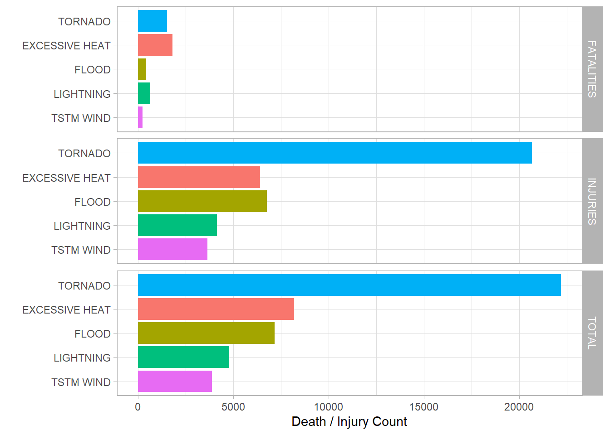
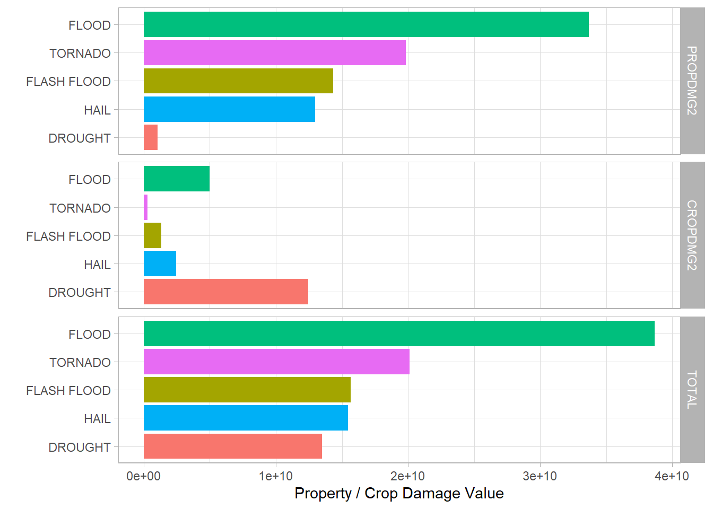

## Impact of Severe Weather Events on Public Health and Economy in the United States
#### Coursera Data Science Specialization 
#### Reproducible Research Course
#### Peer-graded Assignment: Course Project 2

## Synonpsis
<style>
body {
text-align: justify}
</style>

&nbsp;&nbsp;&nbsp;&nbsp;&nbsp;&nbsp;In this report, we aim to analyze the impact of different weather events on public health and economy based on the storm database collected from the U.S. National Oceanic and Atmospheric Administration's (NOAA) from 1950 - 2011. We will use the estimates of fatalities, injuries, property and crop damage to decide which types of event are most harmful to the population health and economy. From these data, we found that tornado and excessive heat are most harmful with respect to population health, while flood and tornado have the greatest economic consequences.

## Loading Needed Libraries


```r
library(dplyr)
library(ggplot2)
library(reshape2)
```

## Loading Data
&nbsp;&nbsp;&nbsp;&nbsp;&nbsp;&nbsp;After stetting up the working directory, we used the ***download.file** function to download the data set as .bz2.
Then we used ***read.csv** function to read directly from the compressed file using the small latter a as the name of the variable for simplicity.


```r
# check & set Working Directory
if(getwd() != "~/RWD/Reproducible-Research-Final-Project")
    setwd("~/RWD/Reproducible-Research-Final-Project")

# Download file
url <- "https://d396qusza40orc.cloudfront.net/repdata%2Fdata%2FStormData.csv.bz2"

if(!file.exists("Storm Data.bz2"))
    download.file(url,"Storm Data.bz2")

#read data
if(!exists("a")) a <- read.csv("Storm Data.bz2")
```

## data Understanding
&nbsp;&nbsp;&nbsp;&nbsp;&nbsp;&nbsp; It's Important to chaeck some info and parameters about the data set we've just loaded.

- see the data set dimensions and size


```r
dim(a)
```

```
## [1] 902297     37
```

```r
oldsize <- format(object.size(a), "MB")
oldsize
```

```
## [1] "471.4 Mb"
```

- see the variables names


```r
names(a)
```

```
##  [1] "STATE__"    "BGN_DATE"   "BGN_TIME"   "TIME_ZONE"  "COUNTY"    
##  [6] "COUNTYNAME" "STATE"      "EVTYPE"     "BGN_RANGE"  "BGN_AZI"   
## [11] "BGN_LOCATI" "END_DATE"   "END_TIME"   "COUNTY_END" "COUNTYENDN"
## [16] "END_RANGE"  "END_AZI"    "END_LOCATI" "LENGTH"     "WIDTH"     
## [21] "F"          "MAG"        "FATALITIES" "INJURIES"   "PROPDMG"   
## [26] "PROPDMGEXP" "CROPDMG"    "CROPDMGEXP" "WFO"        "STATEOFFIC"
## [31] "ZONENAMES"  "LATITUDE"   "LONGITUDE"  "LATITUDE_E" "LONGITUDE_"
## [36] "REMARKS"    "REFNUM"
```

- taking a look into the date column


```r
str(a$BGN_DATE)
```

```
##  chr [1:902297] "4/18/1950 0:00:00" "4/18/1950 0:00:00" "2/20/1951 0:00:00" ...
```
&nbsp;&nbsp;&nbsp;&nbsp;&nbsp;&nbsp; We can see that the date starts from '50s and we are looking for the data starting with 1996. We can move to the next step of our process to adjust that.

## Data Processing
&nbsp;&nbsp;&nbsp;&nbsp;&nbsp;&nbsp; We are going to reduce the size of the data set we've loaded into R by selecting only the desired columns for our study using the column names to embrace the reproducibility. Also, we are going select the records for measurements in 1996 and going forward.


```r
# 1- dataset dimensionality reduction
b <- a %>% select(BGN_DATE, EVTYPE, FATALITIES, INJURIES, PROPDMG, PROPDMGEXP, CROPDMG, CROPDMGEXP) %>%
    filter(as.Date(BGN_DATE, "%m/%d/%Y %H:%M:%S") > "1996-01-01")
```

- we can take a look again at the size of the new dataset 


```r
newsize <- format(object.size(b), "MB")
diff <- format(object.size(a) - object.size(b), "MB")
red <- round(unclass(object.size(b)/object.size(a)*100),2)
```

&nbsp;&nbsp;&nbsp;&nbsp;&nbsp;&nbsp;We can see right now the new dataset is only 40.4 Mb which means that we managed to reduce the size by 431 Mb. Actually, the new dataset is only 8.56 % of the old data set.


```r
head(b)
```

```
##            BGN_DATE       EVTYPE FATALITIES INJURIES PROPDMG PROPDMGEXP CROPDMG
## 1  1/6/1996 0:00:00 WINTER STORM          0        0     380          K      38
## 2 1/11/1996 0:00:00      TORNADO          0        0     100          K       0
## 3 1/11/1996 0:00:00    TSTM WIND          0        0       3          K       0
## 4 1/11/1996 0:00:00    TSTM WIND          0        0       5          K       0
## 5 1/11/1996 0:00:00    TSTM WIND          0        0       2          K       0
## 6 1/18/1996 0:00:00         HAIL          0        0       0                  0
##   CROPDMGEXP
## 1          K
## 2           
## 3           
## 4           
## 5           
## 6
```

&nbsp;&nbsp;&nbsp;&nbsp;&nbsp;&nbsp;Taking a look into the components of the columns PROPDMGEXP and CROPDMGEXP we find that the abbreviate the valuse for billions, millions and thousands for the columns PROPDMG and CROPDMG 


```r
table(b$PROPDMGEXP)
```

```
## 
##             0      B      K      M 
## 276166      1     32 369934   7374
```

```r
table(b$CROPDMGEXP)
```

```
## 
##             B      K      M 
## 373047      4 278685   1771
```

&nbsp;&nbsp;&nbsp;&nbsp;&nbsp;&nbsp;We are going to fix that by creating 2 new columns that is are representing the multiplication of the value and the numeric substitute for the magnitude column


```r
c <- b %>% mutate(PROPDMGEXP2 = case_when(PROPDMGEXP == "B" ~ 100000000,
                                          PROPDMGEXP == "M" ~ 1000000,
                                          PROPDMGEXP == "K" ~ 1000,
                                          TRUE ~ 1)) %>%
    mutate(CROPDMGEXP2 = case_when(CROPDMGEXP == "B" ~ 100000000,
                                   CROPDMGEXP == "M" ~ 1000000,
                                   CROPDMGEXP == "K" ~ 1000,
                                   TRUE ~ 1)) %>%
    mutate(PROPDMG2 = PROPDMG* PROPDMGEXP2) %>% 
    mutate(CROPDMG2 = CROPDMG* CROPDMGEXP2)
```

## Results

&nbsp;&nbsp;&nbsp;&nbsp;&nbsp;&nbsp;We are going to preview the top events affecting the public health 


```r
# 1- Across the United States, which types of events are most harmful with respect to population health?
aggregate(cbind(FATALITIES, INJURIES) ~ EVTYPE, b, sum) %>%
    mutate(TOTAL = FATALITIES + INJURIES) %>%
    top_n(5, TOTAL) %>% 
    melt(id = "EVTYPE", measure.vars = c("FATALITIES", "INJURIES", "TOTAL")) %>%
    ggplot(aes(value, reorder(x = EVTYPE, X = (value)),  fill=EVTYPE)) +
    geom_bar(stat = "identity", show.legend = FALSE) +
    facet_grid(variable~.) +
    xlab(label = "Death / Injury Count") +
    ylab(label = "") +    
    theme_light()
```

<!-- -->

&nbsp;&nbsp;&nbsp;&nbsp;&nbsp;&nbsp;We are going to preview the top events affecting the economy


```r
# 2- Across the United States, which types of events have the greatest economic consequences?
aggregate(cbind(PROPDMG2, CROPDMG2) ~ EVTYPE, c, sum) %>%
    mutate(TOTAL = PROPDMG2 + CROPDMG2) %>%
    top_n(5, TOTAL) %>% 
    melt(id = "EVTYPE", measure.vars = c("PROPDMG2", "CROPDMG2", "TOTAL")) %>%
    ggplot(aes(value, reorder(x = EVTYPE, X = (value)),  fill=EVTYPE)) +
    geom_bar(stat = "identity", show.legend = FALSE) +
    facet_grid(variable~.) +
    xlab(label = "Property / Crop Damage Value") +
    ylab(label = "") +    
    theme_light()
```

<!-- -->
